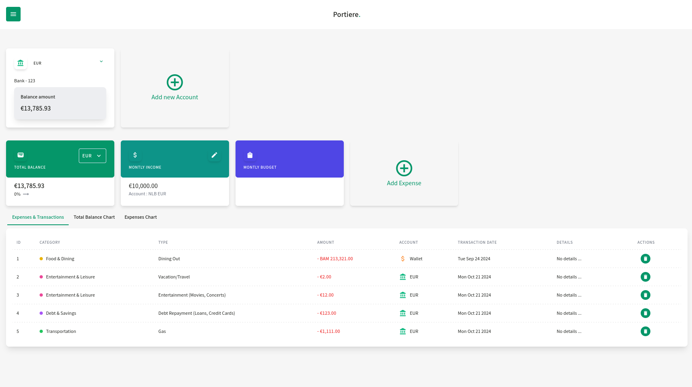

# Portiere Finance Dashboard

A simple finance dashboard application that keeps track of users' bank accounts, total balance in different currencies, and transactions. This app uses **IndexedDB** to store all data locally in the browser.

## Features

- **Track multiple bank accounts**: Manage accounts with different currencies.
- **Transactions management**: Add, delete transactions for each account.
- **Total balance calculation**: Automatically calculates the total balance for all accounts, handling multiple currencies.
- **Currency conversion**: Supports conversion between different currencies based on real-time or preset conversion rates.
- **Local storage with IndexedDB**: All data is stored locally in the browser using IndexedDB, ensuring persistence across sessions without relying on external databases.

## TODO

- **Monltyh budget feature**
- **Expnses chart feature**
- **Address existng bugs**
- **Testing**
